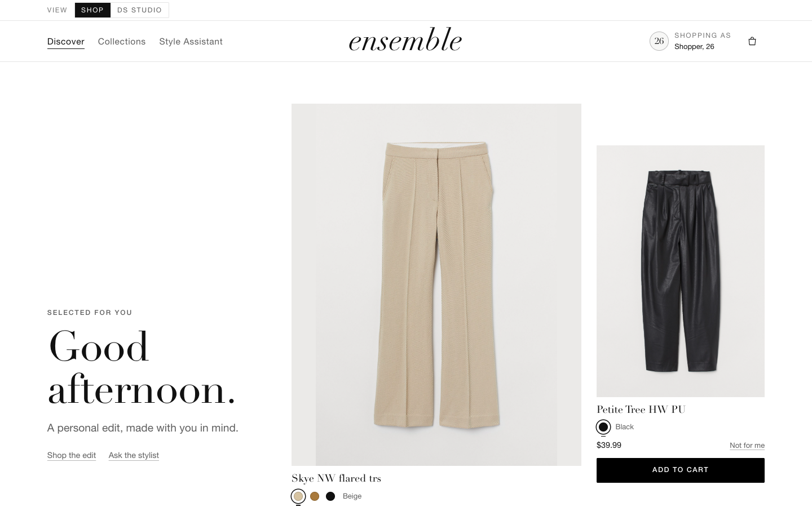
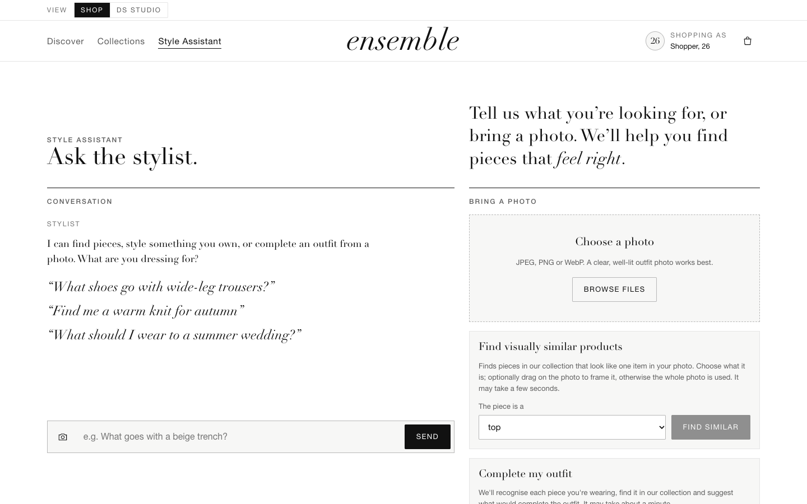
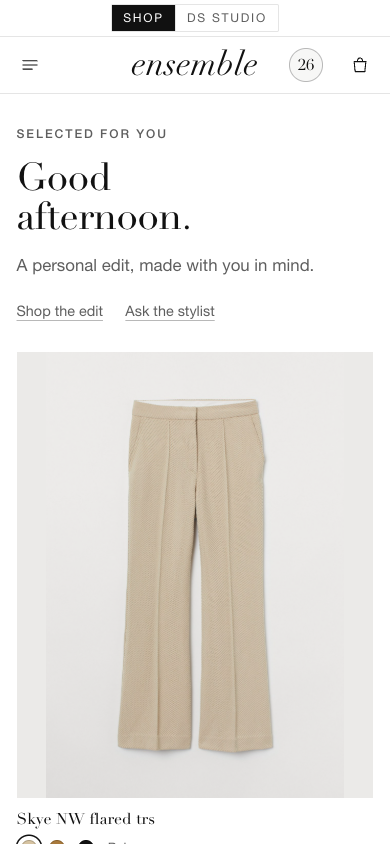
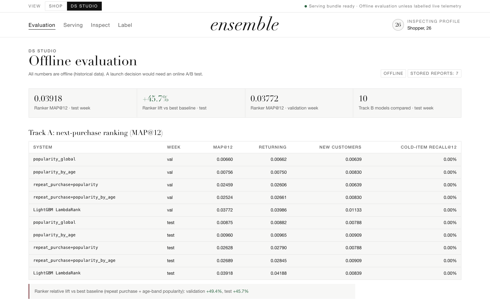
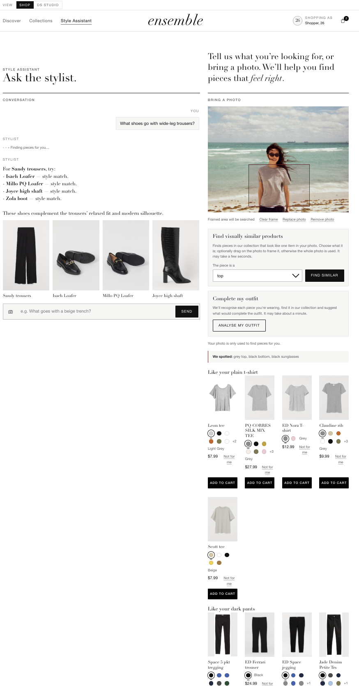
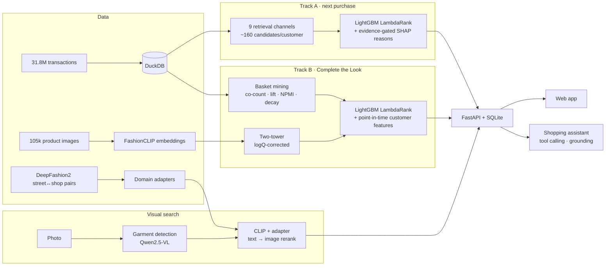

# Ensemble — an outfit-aware fashion recommender

*Ensemble* (n.): a complete outfit, pieces chosen to be worn together.
In machine learning, it also means several models combined. This project is both.

[**Open the live portfolio demo →**](https://yilalalalala.github.io/ensemble-outfit-recommender/)
&nbsp;&nbsp;·&nbsp;&nbsp;
[Architecture](#what-it-does)
&nbsp;&nbsp;·&nbsp;&nbsp;
[Results](#results)
&nbsp;&nbsp;·&nbsp;&nbsp;
[Run locally](#quickstart)



> **The live demo is this application's own frontend**, published as a static build. It is the same HTML,
> CSS and JavaScript that `make serve` serves from FastAPI, and it answers every request from frozen
> responses captured from the local app — the real recommendations, the real Complete-the-Look modules,
> the real catalogue photography and the real evaluation reports. GitHub Pages cannot run FastAPI, SQLite,
> model inference or an LLM, so the public build runs no models and records nothing. Run `make serve`
> locally for the live database, model-backed visual search, outfit analysis and the grounded assistant.

<p align="center">
  
  
</p>



<p align="center">
  
</p>

<p align="center"><em>Style Assistant — grounded recommendation and outfit-photo analysis in the local
model-backed app. The assistant may only cite products a tool returned; the cards below the answer are
those products. On the right, one garment is framed in the photo, matched against the catalogue, and the
outfit's missing slot is filled.</em></p>

**Ensemble recommends clothing the way a stylist would:**
- what *you* will likely buy next;
- what *completes the outfit* you are wearing;
- which catalogue item *matches a photo* you took;

all behind a shopping assistant that can only recommend products the models actually returned.

It is built on the H&M Group dataset: 31.8M purchases, 1.37M customers and 105k articles with images.
Every result is evaluated offline with temporal splits, a popularity baseline and confidence intervals.

---

## Highlights

| capability | result |
| --- | --- |
| **Next-purchase ranking** (H&M Kaggle task, MAP@12) | **0.0333 private leaderboard** (late submission; MVP 0.0319), above the ~0.030 silver line of 3,006 teams. The Phase 2 upgrade adds **+7.5% [+6.9, +8.2]** MAP@12 over the MVP across a 4-week backtest (+53% over a strong rule baseline) and raises candidate recall from 13% to 18–20% ([report](reports/PHASE2_UPGRADE_REPORT.md)) |
| **Complete the Look** (outfit completion) | **+56% Recall@12** over popularity on the held-out week; FashionCLIP image features add +4 points |
| **Visual search** (street photo → product) | Street-to-shop adapters trained on DeepFashion2 raise exact-item **Recall@1 from 0.40 to 0.59** on 154 real outfit-post pairs, and from 0.38 to 0.59 on DeepFashion2 |
| **Shopping assistant** (LLM + tools) | **100% tool accuracy, 0% hallucinated products** over a 24-turn eval, on a free local model (Qwen3-VL) and on Claude Opus 5 |
| **Evaluation you can trust** | The LLM judge is calibrated against 200 human labels: 81% agreement (κ 0.57) on a held-out set |

## What it does



- **Track A: "what will this customer buy next?"** A two-stage recommender (retrieval → ranking), the
  standard industry shape for large catalogues:
  - **Retrieval:** nine channels (repeat purchase, popularity, age-band popularity, department- and
    section-conditioned popularity, co-visitation, item-to-item CF, colour variants, personalised new
    arrivals), with per-channel caps chosen on a recall-vs-candidates Pareto frontier.
  - **Ranking:** a LightGBM LambdaRank model over customer, article, customer×article and
    retrieval-source features.
  - **Reasons:** every recommendation carries readable reasons derived from SHAP values.
- **Track B: "what goes with this?"** Outfit completion across bottoms, shoes, bags and accessories,
  a question the competition never asks:
  - **Labels** come from real baskets; co-count, support, lift, PMI, NPMI and time-decayed
    co-counts are kept as separate features so that "both are best sellers" cannot pass as
    "they go together".
  - **Retrieval:** a candidate union of article- and style-level association, a two-tower model
    with FashionCLIP image features (in-batch negatives + logQ correction), and slot popularity.
  - **Ranking:** a LightGBM LambdaRank model over the union — one query group per
    (basket, anchor, missing slot) — with point-in-time customer affinity features. It replaced a
    fixed reciprocal rank fusion, which is now the reported baseline.
  - **Reasons:** every served pick stores the evidence it was ranked on, and a reason chip is
    only shown when that pair's own evidence supports it.
- **Visual search: "find this".**
  - **Detection:** a vision-language model finds the garments in a street photo.
  - **Matching:** FashionCLIP matches them to catalogue products.
  - **Domain adaptation:** residual adapters trained on 170k DeepFashion2 items close the
    street-to-shop domain gap, the same idea behind Taobao Pailitao and Pinterest Lens.
  - **Two tasks, two defaults:** exact-item search uses the adapted image embedding; substitute
    search retrieves by text and reranks by image, because they are different tasks (see below).
- **Assistant: "something for a wedding, nothing too flashy".**
  - **Orchestration:** an LLM understands the request and calls the recommenders as tools.
  - **Grounding:** it can only cite products a tool returned; anything else is removed and counted as
    a hallucination.
  - **One interface, two back ends:** a free local model (Ollama) and Claude.

## Results

Full readouts: [MVP](reports/MVP_REPORT.md) · [post-MVP improvements](reports/IMPROVEMENTS_REPORT.md) ·
[Track A Phase 2](reports/PHASE2_UPGRADE_REPORT.md) ·
[Track B Round 3](reports/TRACK_B_ROUND3_UPGRADE_REPORT.md) ·
model cards for [Track A](reports/MODEL_CARD_track_a.md) and [Track B](reports/MODEL_CARD_track_b.md).

**Track A: MAP@12**

| system | validation | test | Kaggle private |
| --- | ---: | ---: | ---: |
| popularity | 0.0066 | 0.0088 | |
| repeat purchase + age-band popularity | 0.0252 | 0.0269 | |
| retrieval → LightGBM LambdaRank (MVP) | 0.0355 | 0.0370 | 0.0319 |
| **Phase 2: frontier retrieval + recency features** | **0.0377** | **0.0392** | **0.0333** |

**Track B: Complete the Look, Recall@12** (Round 3 protocol: eligible catalogue from
sales strictly *before* the cutoff, six rolling validation weeks, test week scored once.
Not comparable to the Round-1 numbers — the catalogue and the truth denominator changed.)

| model | validation (6 folds) | test | vs shipped RRF hybrid |
| --- | ---: | ---: | ---: |
| popularity (per slot) | 0.0752 | 0.0884 | −30% |
| association rules (NPMI) | 0.1007 | 0.1202 | −5% |
| hybrid RRF of association + two-tower (Round 1) | 0.1066 | 0.1261 | — |
| fixed RRF over the whole candidate union | 0.1088 | 0.1322 | +5% |
| **learned LambdaRank fusion** | **0.1379** | **0.1596** | **+27%** |
| **+ point-in-time personalization** | **0.1573** | **0.1820** | **+44%** |

Both learned models win on 6/6 validation folds; pooled customer-cluster bootstrap
+47.6% Recall@12 [+46.7%, +48.5%]. Fixed fusion over the *identical* candidate union
gains 2%, so the improvement is the ranking, not a larger candidate set.

**Visual search: exact item found at rank 1** (154 street↔product pairs from real outfit posts; same-style gallery)

| query | Recall@1 | Recall@10 |
| --- | ---: | ---: |
| FashionCLIP crop | 0.40 | 0.88 |
| + background removal | 0.29 | 0.75 |
| **+ DeepFashion2 adapter** | **0.59** | **0.94** |
| text description only | 0.49 | 0.94 |
| **text retrieve → image rerank** | **0.62** | **0.96** |

**Assistant: 24-turn eval**

| back end | tool accuracy | hallucination | median latency | cost / turn |
| --- | ---: | ---: | ---: | ---: |
| Qwen3-VL 8B (local) | 100% | 0% | 17 s | $0 |
| Claude Opus 5 | 100% | 0% | 7.5 s | ≈ $0.02 |

## Findings worth knowing

- **Popularity is a strong opponent.** Every result is reported against it. The two-tower model
  scores *below* popularity without logQ correction (−12%) and well above with it (+33%).
- **Visual similarity helps completion, not next purchase.** CLIP features lift Track B but add
  nothing measurable to Track A (+0.8%, within noise): customers rarely rebuy look-alikes.
- **"Find this exact item" ≠ "find something like this".**
  - Text descriptions find good substitutes but almost never the exact item in a large gallery
    (Recall@1 0.08).
  - The adapted image embedding does the opposite.
  - The product keeps both surfaces, each with its own default.
- **Background removal hurts** in all three visual evaluations, contrary to intuition.
- **LLM judges need human calibration.** The first judge agreed with human labels only 58% of the
  time; a stronger model with a written guideline reached 81% on a held-out set.

## How the evaluation stays honest

- **Temporal splits only.** Every feature takes a cutoff date as a required argument, and tests
  corrupt the label week to prove nothing leaks.
- **The test week is touched once;** model selection happens on validation.
- **Rolling backtests and multi-seed ablations,** so a single lucky week or seed cannot drive a
  decision.
- **Confidence intervals** (cluster bootstrap) on every small-sample number.
- **Human gold labels,** split into a calibration set and a held-out set, the same discipline as
  validation and test.
- **46 architecture decision records** in [docs/DECISIONS.md](docs/DECISIONS.md) state what was
  decided, why, with which numbers, and when to revisit.

## Quickstart

```bash
brew install libomp            # macOS: LightGBM's OpenMP runtime
make setup                     # Python 3.11 venv (uv)
make data                      # H&M data from Kaggle (accept the competition rules first)
make mvp                       # ingest → baselines → retrieval → ranker → Track B → serving → tests
make serve                     # web app at http://localhost:8010
```

**Optional stages:**
```bash
make clip df2                  # FashionCLIP embeddings, DeepFashion2 adapters (DeepFashion2 on request from its authors)
make backtest visual-eval      # rolling backtest, visual-search evaluation
ollama pull qwen3-vl:8b-instruct && ollama pull qwen2.5vl:7b   # local assistant and garment detection
ENSEMBLE_LLM=claude make serve # use Claude instead (ANTHROPIC_API_KEY in .env)
```

`make mvp` takes about 1.5 hours on an Apple-silicon laptop with 16 GB RAM. `make help` lists every
stage.

## Live demo and deployment

There is one frontend, served two ways. `src/ensemble/api/static/` is the source of truth; nothing is
reimplemented for the web.

- **Full application** — `make serve` runs the FastAPI app against the local serving store at
  <http://localhost:8010>. It powers personalized ranking, request-time Complete the Look over a versioned
  serving bundle, SHAP explanations in DS Studio, model-backed visual search, outfit analysis and the
  tool-calling assistant. Its data and model assets stay local: their source licences do not permit
  bundling them into a public repository.
- **Public build** — `portfolio/` is that same frontend, assembled by `make public-demo` and deployed to
  [GitHub Pages](https://yilalalalala.github.io/ensemble-outfit-recommender/) from `main`. GitHub Pages
  serves static files only, so the page runs in **demo mode**: a narrow data adapter
  (`static/js/demo.js`) answers the application's own request paths from frozen responses captured from
  the running local app. Shopper actions that belong in the browser — cart, colour, profile, "Not for
  me" — work exactly as they do locally; event logging is a documented no-op. The public build runs no
  models, stores nothing, and never requests `/api`.

Demo mode is declared by the build, not guessed from the hostname: the generated `index.html` carries
`<meta name="ensemble-demo">`, which the real app never emits. What the public build publishes, and the
limits of that subset, is written up in
[`reports/PUBLIC_DEMO_FULL_UI_REPORT.md`](reports/PUBLIC_DEMO_FULL_UI_REPORT.md); its parameters are in
[`configs/public_demo.yaml`](configs/public_demo.yaml).

Every number in the published DS Studio is the stored evaluation report, published unchanged, and
**offline**: historical data, not production traffic. A launch decision would need an online A/B test.

```bash
make serve                                   # the real application, http://localhost:8010
make public-demo                             # rebuild portfolio/ (needs the local app running)
make public-demo-preview                     # serve portfolio/ at the GitHub project subpath
# open http://localhost:8041/ensemble-outfit-recommender/
```

The Pages workflow is in [`.github/workflows/pages.yml`](.github/workflows/pages.yml).

<details>
<summary>Getting the data</summary>

1. Accept the competition rules:
   <https://www.kaggle.com/competitions/h-and-m-personalized-fashion-recommendations>
2. Install the Kaggle CLI and log in: `uv tool install kaggle && kaggle auth login` (or save a token
   from <https://www.kaggle.com/settings/api> to `~/.kaggle/access_token`).
3. `./scripts/download_data.sh` (CSVs, ~3.5 GB) or `./scripts/download_data.sh --images`
   (adds ~30 GB of images, needed for visual features).
</details>

<details>
<summary>Troubleshooting</summary>

- **`import ensemble` fails in the venv on macOS.** The editable-install `.pth` may carry the
  "hidden" flag, and Python skips hidden `.pth` files. The Makefile sets `PYTHONPATH=src`; to fix
  the venv itself, run `chflags nohidden .venv/lib/python3.11/site-packages/*.pth`.
- **A process hangs with LightGBM and PyTorch.** They ship separate OpenMP runtimes that deadlock
  in one process on macOS. The code keeps them in separate processes.
</details>

## Repository map

```
docs/          DESIGN (system design) · DECISIONS (ADRs) · DATA · GLOSSARY (industry vocabulary)
src/ensemble/
  data/        ingestion, integrity checks, temporal splits
  candidates/  Track A retrieval channels (incl. FashionCLIP channel)
  features/    point-in-time features
  ranking/     LambdaRank training, inference, SHAP explanations
  completion/  Track B basket mining, two-tower, fusion
  vision/      FashionCLIP, visual search, DeepFashion2 adapters, benchmarks, judge calibration
  llm/         provider-neutral LLM layer with a budget guard
  assistant/   tools, agent loop, grounding, eval harness
  evaluation/  metrics, segment analysis, rolling backtest
  api/         serving-store builder, FastAPI app, web UI, public demo build
configs/       every tunable; experiment configs extend default.yaml
portfolio/     the public build of the web UI (generated by `make public-demo`)
reports/       evaluation readouts, model cards, metric JSONs
tests/         leakage, integrity, metrics, API, assistant grounding
```

## Stack

Python · DuckDB · LightGBM · PyTorch · FashionCLIP (Hugging Face) · FastAPI · SQLite · MLflow ·
Ollama (Qwen3-VL, Qwen2.5-VL) · Anthropic API

## Data and licensing

- **No data is in this repository.** H&M competition data and DeepFashion2 (research use) must be
  obtained from their sources under their own terms. The exception is the bounded subset of catalogue
  photography republished, downscaled, in the non-commercial public demo and in the README screenshots;
  the count and the selection rule are in the demo's manifest and report.
- **Every published screenshot and every published page is the real application.** No product image is
  AI-generated and no interface is mocked up.
- **Outfit photos** used for evaluation are either openly licensed Wikimedia Commons images (credited in
  `data/raw/outfit_photos/CREDITS.csv`) or private test images. Only one of the openly licensed photos is
  published — in the demo's saved photo example, with its credit shown on the page. The Style Assistant
  screenshot above additionally shows one private test photo, published deliberately as a screenshot of
  the local app.
- **All results are offline.** A launch decision would need an online A/B test.
